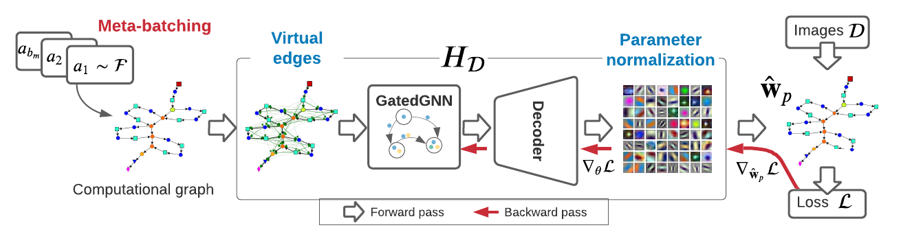
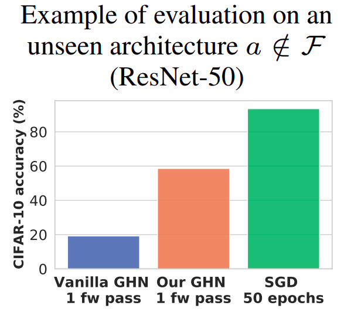
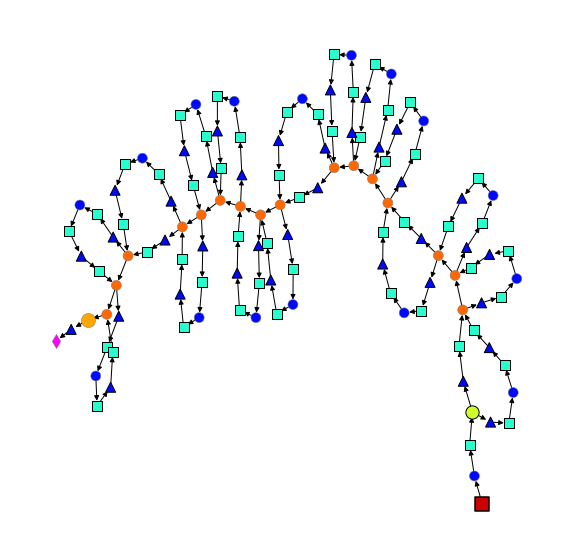
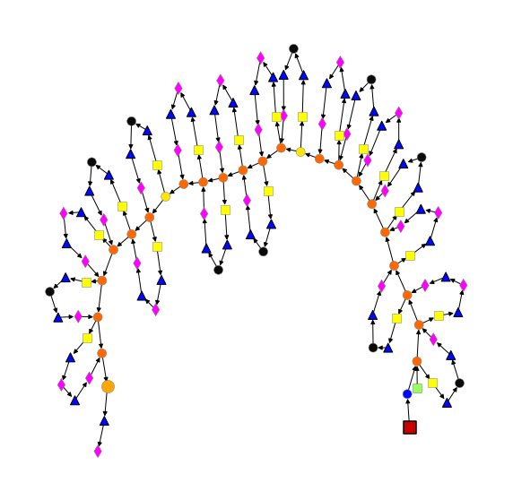
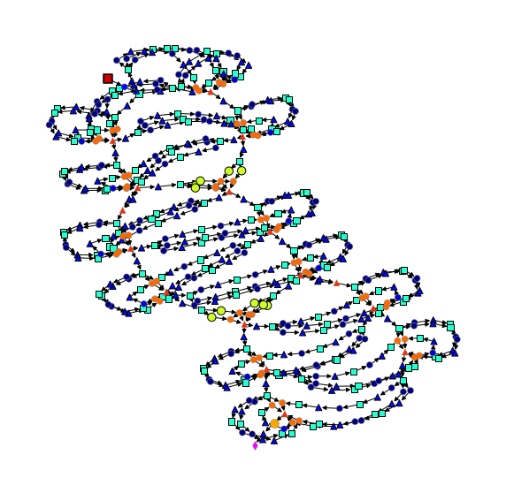

# Parameter Prediction for Unseen Deep Architectures (NeurIPS 2021)

authors: [Boris Knyazev](http://bknyaz.github.io/), [Michal Drozdzal](https://scholar.google.es/citations?user=XK_ktwQAAAAJ&hl=en), [Graham Taylor](https://www.gwtaylor.ca/), [Adriana Romero-Soriano](https://sites.google.com/site/adriromsor/)

| Overview |  Results on ResNet-50 
|:-------------------------:|:-------------------------:|
| <figure> </figure> | <figure> </figure> |

This repository contains the code to train and evaluate [Graph HyperNetworks (GHNs)](https://arxiv.org/abs/1810.05749). This repository also contains the DeepNets-1M dataset of neural architectures proposed in our paper to train and evaluate GHNs. Our improved GHNs trained on our DeepNets-1M allow to predict parameters for diverse networks, even if they are very different from those used to train GHNs  (e.g. ResNet-50). Parameter prediction by GHNs is performed in a single forward pass and on average takes < 1 second either on GPU or CPU!

We provide a [Google Colab notebook](https://colab.research.google.com/drive/1fU0JU6p73QThJiakFPLNoOmkbDEYw2xf?usp=sharing) to experiment with parameter prediction on the CIFAR-10 dataset. [Video](https://youtu.be/JldVSaQ0rjw) walking through the colab notebook and showing parameter prediction in real time.

<figure> </figure>

# Table of Contents  
- [Requirements and installation](#requirements-and-installation)
- [Available GHNs](#available-ghns)
- [Minimal example: predict parameters for ResNet-50](#minimal-example--predict-parameters-for-resnet-50)
- [Data](#data)
  * [DeepNets-1M](#deepnets-1m)
  * [CIFAR-10](#cifar-10)
  * [ImageNet](#imagenet)
- [Reproducing main results](#reproducing-main-results)
  * [DeepNets-1M results](#deepnets-1m-results)
    + [Training GHN](#training-ghn)
    + [Evaluating GHNs](#evaluating-ghns)
    + [Training and evaluating SGD](#training-and-evaluating-sgd)
  * [Fine-tuning predicted parameters on other tasks](#fine-tuning-predicted-parameters-on-other-tasks)
    + [100-shot CIFAR-10](#100-shot-cifar-10)
    + [Object detection](#object-detection)
  * [Property prediction](#property-prediction)
    + [NAS](#nas)
- [Visualization](#visualization)
- [License](#license)
- [Contributions](#contributions)
- [Acknowledgements](#acknowledgements)
- [Citation](#citation)


# Requirements and installation

The main requirements are:
- Python 3.6+
- PyTorch 1.9+
- NetworkX

For graph visualizations we use `pygraphviz`. To make it work, `graphviz` may need to be installed as `sudo apt-get install graphviz graphviz-dev`.

## To install the ppuda package

```
pip install git+https://github.com/facebookresearch/ppuda
```

NOTE: It's also possible to install the package in editable mode via
```
pip install -e .
```

## To obtain all packages required for every file

This step may be needed only if the package installation is failed/skipped.
```
pip install -r requirements.txt
```

It's also possible to use conda to install this by running:

`conda create --name ppuda --file requirements.txt --channel default --channel anaconda --channel conda-forge --channel pytorch`

# Available GHNs 

We release five GHNs. Below are top-1 accuracies on CIFAR-10 and top-5 accuracies on ImageNet using the parameters predicted by one of the GHNs.

| Model |   ResNet-50<sup>*</sup>   | Best Architecture (index<sup>‡</sup>) |
|---|:---------:|:------------------------:|
[MLP-CIFAR-10](./checkpoints/mlp_cifar10.pt)    | 17.7 | 60.2 (167) |
[GHN-1-CIFAR-10](./checkpoints/ghn1_cifar10.pt) | 19.2 | 59.9 (179) |
[GHN-2-CIFAR-10](./checkpoints/ghn2_cifar10.pt) | 58.6 | 77.1 (210) |
[GHN-1-ImageNet](./checkpoints/ghn1_imagenet.pt) | 6.9 | 32.1 (295) |
[GHN-2-ImageNet](./checkpoints/ghn2_imagenet.pt) | 5.3 | 48.3 (85)  |

<sup>*</sup> ResNet-50 is an unseen architecture (i.e. trained GHNs have not observed such or even similar architectures during training). Our GHNs can still predict good parameters for such unseen architectures. On ImageNet, even though the performance is low, the predicted parameters are very useful for [fine-tuning](#fine-tuning-predicted-parameters-on-other-tasks).

<sup>‡</sup> Denotes the architecture index in the `test` split of DeepNets-1M.


Each GHN checkpoint takes just a few megabytes and is stored in the [checkpoints](./checkpoints) folder of this repository. Other checkpoints (ablated GHN models, some networks trained with SGD) are available [here](https://drive.google.com/drive/folders/1Oj3M1kzvpEANw_KuB9iBaRPbEbuNKrqg?usp=sharing).

# Minimal example: predict parameters for ResNet-50

**ImageNet:**
```
from ppuda.ghn.nn import GHN2
import torchvision.models as models

ghn = GHN2('imagenet')      # load our GHN-2 trained on ImageNet
model = models.resnet50()   # ResNet-50 or any other torchvision model
model = ghn(model)          # predict parameters in < 1 second on GPU/CPU

# That's it! The model can be now evaluated on ImageNet to obtain top5=5.2%.
```

**CIFAR-10:**
```
from ppuda.ghn.nn import GHN2
import torchvision.models as models

# On CIFAR-10, we have an additional step of adjusting 
# the first layer(s) of the network for a 32x32 image size,
# since torchvision models expect a 224x224 input, 
# while GHNs on CIFAR-10 were trained on 32x32 inputs.

from ppuda.utils import adjust_net

ghn = GHN2('cifar10')                    # load our GHN-2 trained on CIFAR-10
model = models.resnet50(num_classes=10)  # ResNet-50 
model = adjust_net(model)                # adjust to a 32x32 input
model = ghn(model)                       # predict parameters in < 1 second on GPU/CPU

# That's it! The model can be now evaluated on CIFAR-10 to obtain top1=58.6%.
```                       

Full example for ResNet-50 and [other torchvision models](https://pytorch.org/vision/stable/models.html) can be found in [examples/torch_models.py](examples/torch_models.py) and [examples/all_torch_models.py](examples/all_torch_models.py).
See other examples in [examples](examples).

Note 1: For the networks with batch norm, the running statistics of batch norm layers are not predicted (since these statistics are not trainable parameters). So to evaluate such networks, our code computes batch statistics on the evaluation set with batch size = 64. The networks without batch norm (e.g. in our BN-Free split) have the same accuracies regardless of the batch size.

Note 2: To evaluate/train on ImageNet, follow the [data instructions](#data) below on how to prepare the ImageNet dataset.


# Data

## DeepNets-1M

To train or evaluate on DeepNets-1M, first download the dataset file by running [./data/download.sh](./data/download.sh).

To generate a new DeepNets-1M dataset, the following command can be used: 

`python experiments/net_generator.py train 1000000 ./data`

The dataset generated using this command should be close to our training dataset. Other splits can be regenerated by specifying the split as the first argument.

## CIFAR-10

[CIFAR-10](https://www.cs.toronto.edu/~kriz/cifar.html) is downloaded automatically and is saved in the `--data_dir` folder (default is `./data`).

## ImageNet

We implemented a [simple wrapper](ppuda/vision/imagenet.py) of the `torchvision.datasets.ImageNet` implementation. The ImageNet root folder `imagenet` is expected to be in the `./data` folder by default with the following structure:

```
./data
│   imagenet
│   │   train
|   |   |    n01440764
|   |   |    n01443537
|   |   |    ...
│   │   val
|   |   |    n01440764
|   |   |    n01443537
|   |   |    ...
│   │   ILSVRC2012_devkit_t12.tar.gz
│   deepnets1m_train.hdf5       
|   deepnets1m_train_meta.json
|   ...
```

Both `imagenet/train` and `imagenet/val` must contain separate folders for each class. Follow the [official instructions](https://www.image-net.org/challenges/LSVRC/index.php) on how to obtain ImageNet (ILSVRC 2012) data.

# Reproducing main results

The arguments of our scripts are described in [config.py](ppuda/config.py). The default hyperparameters are based on our paper. Below, the examples to run the scripts and override the default hyperparameters are shown.

## DeepNets-1M results

### Training GHN

- GHN-1 on CIFAR-10: `python experiments/train_ghn.py --name ghn1`

- GHN-2 on CIFAR-10: `python experiments/train_ghn.py -m 8 -n -v 50 --ln --name ghn2`

- MLP on CIFAR-10: `python experiments/train_ghn.py -m 8 -n -v 50 --ln -H mlp --name mlp`

where `-m 8` denotes meta batch size = 8, `-n` denotes to normalize predicted parameters, `-v 50` denotes adding virtual edges to graphs with 50 as the maximum shortest path length, `--ln` denotes adding layer normalization before decoding the parameters, `--name ghn2` denotes the directory name where to save trained checkpoints (which is combined with `--save_dir` to obtain the full path), `-H mlp` denotes using MLP instead of GatedGNN.

To train on Imagenet, use `-d imagenet`. 
To train GHNs on multiple GPUs (e.g. with a large meta batch size), add `--multigpu` to use all CUDA devices available (make sure to set `CUDA_VISIBLE_DEVICES` appropriately).

For example, to train GHN-2 on Imagenet and 4 GPUs: `export CUDA_VISIBLE_DEVICES=0,1,2,3; python experiments/train_ghn.py -m 8 -n -v 50 --ln --name ghn2_imagenet -d imagenet --multigpu`


### Evaluating GHNs

- Evaluate GHN-2 on CIFAR-10 on all architectures of `$split` from DeepNets-1M: `python experiments/eval_ghn.py --ckpt ./checkpoints/ghn2_cifar10.pt -d cifar10 --split $split`

- Evaluate GHN-2 on CIFAR-10 on a single architecture from DeepNets-1M: `python experiments/eval_ghn.py --ckpt ./checkpoints/ghn2_cifar10.pt -d cifar10 --split $split --arch $ind`

where `$split` is one from `val, test, wide, deep, dense, bnfree, predefined`, `$ind` is an integer index of the architecture in a split.


### Training and evaluating SGD

- Train architecture=0 from the `test` split of DeepNets-1M for 50 epochs on CIFAR-10: `python experiments/sgd/train_net.py --split test --arch 0 --epochs 50`

- Train the best architecture from the DARTS paper for 50 epochs on CIFAR-10: `python experiments/sgd/train_net.py --arch DARTS --epochs 50`

- Train architecture=0 from the `wide` split of DeepNets-1M for 1 epoch on ImageNet: `python experiments/sgd/train_net.py --split wide --arch 0 --epochs 1 -d imagenet`


## Fine-tuning predicted parameters on other tasks

The parameters predicted by GHN-2 trained on ImageNet can be fine-tuned on any vision dataset, such as CIFAR-10.


### 100-shot CIFAR-10

- Fine-tune **ResNet-50** initialized with the parameters predicted by **GHN-1-ImageNet**: `python experiments/sgd/train_net.py --split predefined --arch 0 --epochs 50 -d cifar10 --n_shots 100 --wd 1e-3 --ckpt ./checkpoints/ghn1_imagenet.pt`

- Fine-tune **ResNet-50** initialized with the parameters predicted by **GHN-2-ImageNet**: `python experiments/sgd/train_net.py --split predefined --arch 0 --epochs 50 -d cifar10 --n_shots 100 --wd 1e-3 --ckpt ./checkpoints/ghn2_imagenet.pt`

- Fine-tune **ResNet-50** initialized randomly with Kaiming He's method: `python experiments/sgd/train_net.py --split predefined --arch 0 --epochs 50 -d cifar10 --n_shots 100 --wd 1e-3`

- Fine-tune **ResNet-50** pretrained on Imagenet:
`python experiments/sgd/train_net.py --split predefined --arch 0 --epochs 50 -d cifar10 --n_shots 100 --wd 1e-3 --pretrained`

- Fine-tune **ViT** initialized with the parameters predicted by **GHN-2-ImageNet**: `python experiments/sgd/train_net.py --split predefined --arch 1 --epochs 50 -d cifar10 --n_shots 100 --wd 1e-3 --ckpt ./checkpoints/ghn2_imagenet.pt`

- Fine-tune **DARTS** initialized with the parameters predicted by **GHN-2-ImageNet**: `python experiments/sgd/train_net.py --arch DARTS --epochs 50 -d cifar10 --n_shots 100 --wd 1e-3 --init_channels 48 --layers 14 --ckpt ./checkpoints/ghn2_imagenet.pt`


`--wd 1e-3` was generally the best in these experiments. To report the results in the paper, we also tuned the initial learning rate on the 200 validation images of the 100-shot CIFAR-10 training set, so the results obtained with the scripts above might be a bit different from the reported ones.

### Object detection

In the paper, we fine-tune on Penn-Fudan object detection. Our experiments are based on [PyTorch Object Detection Finetuning Tutorial](https://pytorch.org/tutorials/intermediate/torchvision_tutorial.html).

The dataset can be downloaded from [here](https://www.cis.upenn.edu/~jshi/ped_html/PennFudanPed.zip) and should be put inside the `./data` folder like `./data/PennFudanPed`.

The commands to fine-tune/train networks for object detection are similar to those for 100-shot CIFAR-10 above, but are based on the [experiments/sgd/detector/train_detector.py](experiments/sgd/detector/train_detector.py) script and the hyperparameters from the tutorial. For example, to fine-tune **DARTS** initialized with the parameters predicted by **GHN-2-ImageNet**.
```
python experiments/sgd/detector/train_detector.py -d PennFudanPed --arch DARTS --ckpt ./checkpoints/ghn2_imagenet.pt --init_channels 48 --layers 14
```
## Property prediction

To train and evaluate regression models on top of graph embeddings extracted using GHN-2-CIFAR-10:

`python experiments/property_prediction.py cifar10 ./checkpoints/ghn2_cifar10.pt`

The script will evaluate the four properties of architectures discussed in the paper: accuracy on the clean test set, accuracy on a corrupted test set, inference speed, and speed of convergence.

The extracted embeddings in the .npy format for each GHN are available in the [checkpoints](checkpoints) folder, but will be recomputed if they are missing.

### NAS

Training the best (in terms of accuracy in this example) architecture on CIFAR-10 with SGD for 600 epochs according to the DARTS protocol:

`python experiments/sgd/train_net.py --split search --arch 35133 --epochs 600 --cutout --drop_path_prob 0.2 --auxiliary`

Architecture 35133 was found to be the best in the `search` split on CIFAR-10 using our GHN-2.


# Visualization

Example of visualizing the computational graph of ResNet-50.

```
import torchvision
from ppuda.deepnets1m.graph import Graph

Graph(torchvision.models.resnet50()).visualize(node_size=100)
```

Example of visualizing the computational graph of the best [DARTS](https://github.com/quark0/darts) network.

```
from ppuda.deepnets1m.graph import Graph
from ppuda.deepnets1m.net import Network
from ppuda.deepnets1m.genotypes import DARTS

model = Network(C=48, num_classes=1000, genotype=DARTS, n_cells=14)
Graph(model).visualize(node_size=50)
```

| ResNet-50 |  ViT | DARTS  | 
|:-------------------------:|:-------------------------:|:-------------------------:|
| <figure> </figure> | <figure> </figure> | <figure> </figure> | 

See more examples for different architectures in [examples/graph_visualization.ipynb](examples/graph_visualization.ipynb).

# License

The majority of PPUDA is licensed under [MIT license](LICENSE), however portions of the project are available under separate license terms: DARTS is licensed under the Apache 2.0 license and NetworkX is licensed under the 3-Clause BSD license.

# Contributions

Please submit a pull request or open a github issue (see the [details](CONTRIBUTING.md)). 
Make sure to comply with our [code of conduct](CODE_OF_CONDUCT.md).

# Acknowledgements

We thank the [Vector AI](https://vectorinstitute.ai/) Engineering team (Gerald Shen, [Maria Koshkina](https://mkoshkina.github.io/) and Deval Pandya) for code review.

# Citation

```
@inproceedings{knyazev2021parameter,
  title={Parameter Prediction for Unseen Deep Architectures},
  author={Knyazev, Boris and Drozdzal, Michal and Taylor, Graham W and Romero-Soriano, Adriana},
  booktitle={Advances in Neural Information Processing Systems},
  year={2021}  
}
```
